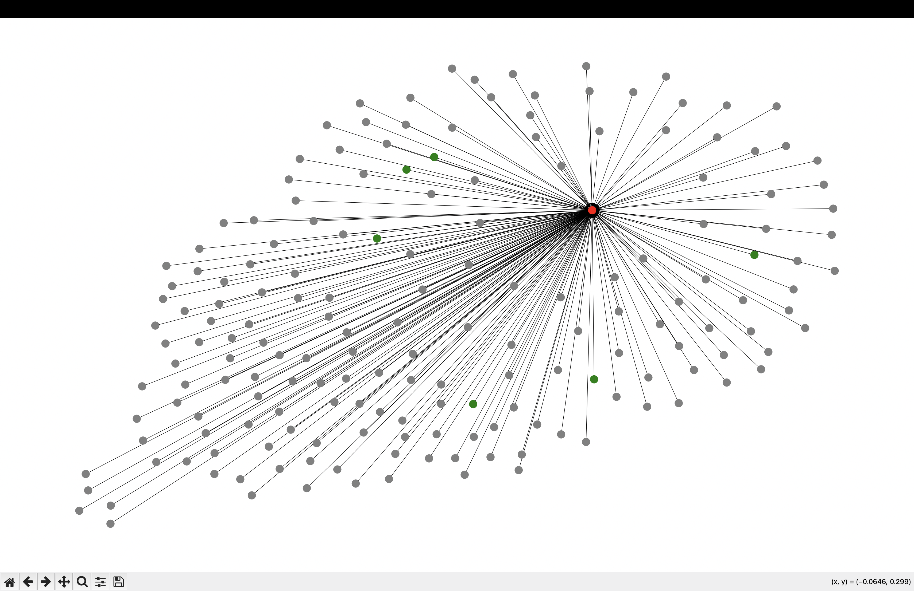

# Temporal Fraud GNN

A Temporal Graph Network (TGN) for detecting financial fraud rings on the Elliptic Bitcoin transaction dataset. Built from scratch using PyTorch and PyTorch Geometric — no TGN library used.

--- 

## The Core Idea



Standard fraud detection treats every transaction as an independent row in a CSV. Real financial crime doesn't work that way — money laundering is a *network problem*. Accounts form rings, burner wallets relay funds, and sleeper accounts sit dormant for months before activating.

This project models the Bitcoin transaction network as a dynamic graph where:
- Every **node** is a Bitcoin transaction
- Every **edge** is a flow of funds between transactions
- Every node has a **memory vector** that accumulates its behavioral history over time

The model learns to detect fraud not from individual transactions, but from how suspicious subgraphs evolve over time.

---

## Architecture
\```

Transaction Stream (timestep t)
↓
Fetch node memories (from previous timesteps)
↓
Compute transaction messages
[src_memory || dst_memory || time_delta || edge_features]
↓
GRU Memory Updater → new memory vectors (detached)
↓
Concatenate updated memory with raw node features
↓
3-layer GraphSAGE
↓
Linear Classifier → P(fraud | transaction)

\```

---
### Components Built From Scratch

**TGNMemory** — persistent node memory store. Each of the 203,769 nodes maintains a 64-dimensional memory vector initialized to zero and updated after every transaction it participates in. Uses `register_buffer` so memory is saved with the model but not treated as a trainable parameter.

**MessageFunction** — when a transaction occurs between nodes A and B, computes a message vector by concatenating:
- A's current memory (64-dim)
- B's current memory (64-dim)
- Time delta — how long since A last transacted (1-dim)
- Edge features — transaction timestamp (1-dim)

Total: 130-dim → linear layer → 64-dim message

**MemoryUpdater** — a GRUCell that takes the computed message and the node's current memory and produces an updated memory vector. Memory is detached before storage to prevent gradients from flowing through the full transaction history.

**GraphSAGE (3 layers)** — operates on node features concatenated with updated memory (166 + 64 = 230 input dimensions). Each layer aggregates from 1-hop, 2-hop, and 3-hop neighborhoods respectively.

---

## Fraud Patterns Targeted

**Burst Attack (Smurfing)** — a central node receiving massive transaction volume within a single timestep, designed to stay below reporting thresholds.

**Sleeper Cell** — a node with zero activity for many timesteps suddenly executing large transfers. Detectable via the time delta signal in the memory update.

**Chronological Layering** — A→B before B→C forms a directed cycle. A static graph sees a triangle. The temporal model sees a sequence — money laundering in motion.

---

## Dataset

**Elliptic Bitcoin Transaction Dataset** — used in published GNN fraud detection research.

| Property | Value |
|---|---|
| Nodes | 203,769 |
| Edges | 234,355 |
| Node features | 166 |
| Illicit (fraud) nodes | 4,545 |
| Licit (legitimate) nodes | 42,019 |
| Unknown nodes | 157,205 |
| Timesteps | 49 (2-week intervals) |

Class imbalance ratio: ~9:1 (legitimate:fraud). Handled via weighted CrossEntropyLoss with fraud weight 9.25.

---

## Temporal Evaluation

A critical design decision: the dataset is split by **time**, not randomly.

| Split | Timesteps | Nodes |
|---|---|---|
| Train | 1 — 34 | 29,894 |
| Validation | 35 — 41 | 7,829 |
| Test | 42 — 49 | 8,841 |

Random splitting would allow the model to train on timestep 40 data and test on timestep 5 — leaking future information into training. Temporal splitting enforces the constraint that the model can only predict the future, never the past.

When I first got 0.9275 I thought the model was incredible. Then I realized the random split was letting the model train on future data — it was basically cheating. The real number after fixing the split was 0.6349. Most fraud detection projects on Kaggle never catch this

---

## Results

### 1.  After Zero-Grad Memory Warmup
In a real-world deployment, a bank does not retrain model weights weekly, but the transaction stream never stops. To simulate this, the TGN implements a **Zero-Grad Memory Warmup**:
1. **Train** weights from t=1 to 34.
2. **Freeze** weights.
3. **Fast-forward** the transaction stream from t=35 to 41 purely to update the TGN Memory Bank.
4. **Evaluate** on strictly unseen future data from t=42 to 49.

| Model | Inference Strategy | Sampling | Test F1 |
|---|---|---|---|
| TGN | Zero-Grad Memory Warmup | 4-hop Subgraph | **0.7173** |

Achieving an F1 score of **0.7173** on strictly unseen future data—using neural network weights up to 15 timesteps out of date—proves the TGN learns fundamental rules of money laundering. The dynamic memory module successfully carries the real-time situational context forward.
### 2. Directly  tested without Warmup  
| Model | Split Strategy | Test F1 |
|---|---|---|
| GraphSAGE (baseline) | Random | 0.9275 |
| GraphSAGE (baseline) | Temporal | 0.6349 |
| TGN (this project) | Temporal | 0.7350 |

The loss during training for the TGN model was significantly higher than the baseline models. In the baseline, data across all timesteps was fed at once and a single loss was calculated. In this architecture, loss is accumulated sequentially over all 34 training timesteps, making the total naturally higher. The steady decrease from 23.0 down to 1.4 over 50 epochs demonstrated clear model convergence.

The significant performance jump over the temporal baseline demonstrates the critical value of the persistent memory bank. While the baseline makes each prediction in isolation with no historical context, the TGN successfully carries behavioral sequences forward. This gives the model the temporal depth required to flag sophisticated laundering patterns, such as sleeper accounts that suddenly trigger massive transfers after long periods of dormancy.

---
## Ablation Study: Subgraph Sampling Hops (without warm-up)

To enable memory-efficient training, full-graph training was replaced with temporal subgraph sampling. The number of hops controls how large each subgraph is — more hops = more context but higher memory and compute cost.

| Model | Split | Sampling | Hops | Test F1 |
|---|---|---|---|---|
| GraphSAGE | Random | Full graph | — | 0.9275 |
| GraphSAGE | Temporal | Full graph | — | 0.6349 |
| TGN | Temporal | Full graph | — | 0.7350 |
| TGN | Temporal | Subgraph | 3 | 0.6975 |
| TGN | Temporal | Subgraph | 4 | **0.7289** |
| TGN | Temporal | Subgraph | 5 | 0.7196 |
| TGN + GAT | Temporal | Subgraph | 4 | 0.7039 |

4-hop sampling achieves the best balance — enough neighborhood context to capture fraud ring structure without introducing noise from distant irrelevant nodes. Beyond 4 hops performance degrades, suggesting that fraud patterns in the Elliptic dataset are localized within 4 transaction hops.

## Key Engineering Decisions

**Why GraphSAGE over GCN** — GraphSAGE uses sampling-based aggregation and generalizes to unseen nodes. GCN requires the full graph during training, which doesn't scale to dynamic graphs where new nodes appear each timestep.

**Why detach memory** — backpropagating through the full transaction history of a node with hundreds of past interactions would require unrolling hundreds of gradient steps, causing vanishing gradients and extreme memory usage. Detaching memory after each update treats stored memory as fixed context — the GRU weights still learn how to compress history, but gradients don't flow through the history itself.

**Why weighted loss** — with 9:1 class imbalance, a model predicting "legitimate" for everything achieves 90% accuracy. Weighted CrossEntropyLoss penalizes fraud misclassification 9.25x more than legitimate misclassification, forcing the model to learn the minority class.

**Why temporal splits** — random splits inflate performance by testing on transactions from the same time periods as training. Real fraud detection systems only ever predict future transactions. Temporal splits enforce this constraint and give an honest performance estimate.

**The problems i faced** - the hardest part was getting the temporal masking right — creating separate node masks and edge masks for each time split while making sure no future data leaked into training. the syntax was unintuitive and took a while to get right.
had to read the original TGN paper (Rossi et al. 2020) to understand the memory update order — specifically whether to update memory before or after the GraphSAGE forward pass. ended up going with update-first then classify, but update-after-classify is a valid alternative and something i want to experiment with next.
no tutorials exist for this — had to piece it together from the paper and PyG documentation directly.

## Project Structure

\```
temporal-fraud-gnn/
data_generator.py     # loads Elliptic dataset, builds PyG Data object, temporal splits
model.py              # baseline GraphSAGE (FraudGNN)
memory_module.py      # TGNMemory, MessageFunction, MemoryUpdater
tgn.py                # full TGN model connecting all components
train.py              # temporal training loop, timestep-by-timestep
visualize.py          # fraud ring neighborhood visualization
\```

---
## Setup

```bash
git clone https://github.com/ritugupta8898-cloud/temporal-fraud-gnn.git
cd temporal-fraud-gnn
python -m venv venv
source venv/bin/activate
pip install torch torch_geometric scikit-learn networkx matplotlib pandas
```

Download the Elliptic Bitcoin dataset from Kaggle and place it in `elliptic_bitcoin_dataset/`.

```bash
python data_generator.py   # builds and saves elliptic_graph.pt
python train.py            # trains TGN, prints epoch loss and test F1
python visualize.py        # renders fraud ring visualization
```

---

## Future Improvements

- **Attention-based message aggregation** — replace mean aggregation in GraphSAGE with attention weights, allowing the model to focus on the most suspicious neighboring transactions
- **Kafka streaming integration** — replace batch timestep processing with real-time transaction streaming to simulate live banking environment
- **Burst attack detector** — explicit detection module for smurfing patterns using transaction velocity features
- **Sleeper cell detector** — threshold-based alert when time delta exceeds a learned dormancy threshold
- **Hyperparameter search** — memory_dim, hidden_dim, learning rate optimization via grid search

---
## License and Copyright

© 2026 Pratyush Gupta. All Rights Reserved. 

This repository and its contents are provided for educational and portfolio review purposes only. No license is granted to use, copy, modify, or distribute this software or its documentation, in whole or in part, without explicit prior written permission from the author.

## References

- Rossi et al. (2020) — *Temporal Graph Networks for Deep Learning on Dynamic Graphs* — arXiv:2006.10637
- Elliptic Dataset — *Anti-Money Laundering in Bitcoin* — Elliptic, MIT# Temporal Fraud GNN

A Temporal Graph Network (TGN) for detecting financial fraud rings on the Elliptic Bitcoin transaction dataset. Built from scratch using PyTorch and PyTorch Geometric — no TGN library used.

--- 

